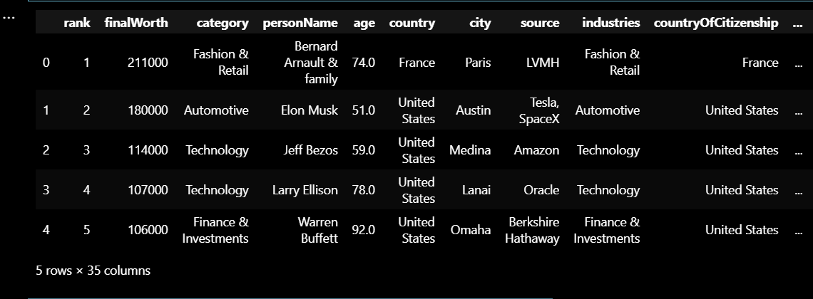
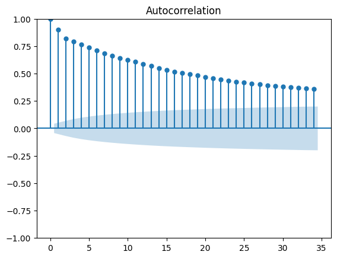
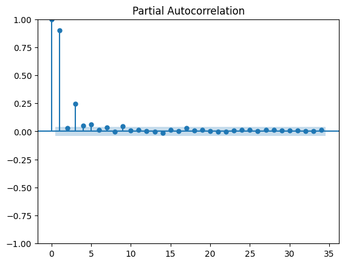
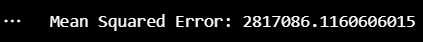
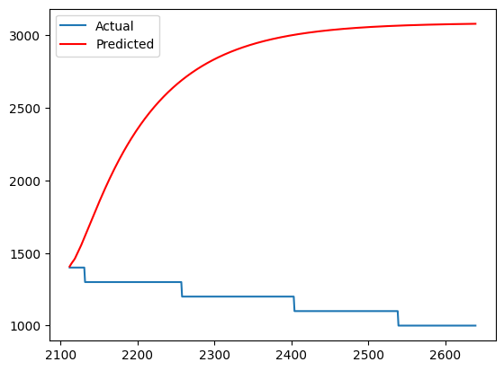

# Ex.No: 07                                       AUTO REGRESSIVE MODEL
### Date: 
#### NAME : KAVINRAJA D
#### REG NO : 212222240047
### AIM:
To Implementat an Auto Regressive Model using Python
### ALGORITHM:
1. Import necessary libraries
2. Read the CSV file into a DataFrame
3. Perform Augmented Dickey-Fuller test
4. Split the data into training and testing sets.Fit an AutoRegressive (AR) model with 13 lags
5. Plot Partial Autocorrelation Function (PACF) and Autocorrelation Function (ACF)
6. Make predictions using the AR model.Compare the predictions with the test data
7. Calculate Mean Squared Error (MSE).Plot the test data and predictions.
### PROGRAM
#### Import necessary libraries
```py
import pandas as pd
import numpy as np
from statsmodels.tsa.ar_model import AutoReg
from statsmodels.graphics.tsaplots import plot_acf, plot_pacf
import matplotlib.pyplot as plt
from statsmodels.tsa.stattools import adfuller
```
#### Read the CSV file into a DataFrame
```py
data = pd.read_csv("Billionaires Statistics Dataset.csv")
```
#### Perform Augmented Dickey-Fuller test
```py
result = adfuller(data['finalWorth'])
print('ADF Statistic:', result[0])
print('p-value:', result[1])
```
#### Split the data into training and testing sets
```py
train_size = int(len(data) * 0.8)
train, test = data[:train_size], data[train_size:]
```
#### Fit an AutoRegressive (AR) model with 13 lags
```py

model = AutoReg(train['finalWorth'], lags=13)
model_fit = model.fit()
```
#### Plot Partial Autocorrelation Function (PACF) and Autocorrelation Function (ACF)
```py

plot_acf(train['finalWorth'])
plt.show()
plot_pacf(train['finalWorth'])
plt.show()
```
#### Make predictions using the AR model
```py
predictions = model_fit.predict(start=len(train), end=len(train)+len(test)-1, dynamic=False)
```
#### Compare the predictions with the test data
```py
mse = ((predictions - test['finalWorth']) ** 2).mean()
print('Mean Squared Error:', mse)
```
#### Plot the test data and predictions
```py
plt.plot(test.index, test['finalWorth'], label='Actual')
plt.plot(test.index, predictions, color='red', label='Predicted')
plt.legend()
plt.show()
```
### OUTPUT:
#### GIVEN DATA

#### Augmented Dickey-Fuller test

#### PACF - ACF


#### Mean Squared Error

#### PREDICTION

### RESULT:
Thus we have successfully implemented the auto regression function using python.
